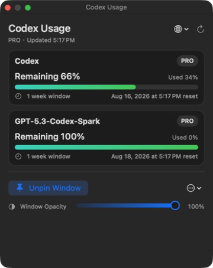

# Codex Usage Monitor for macOS

[English](README.md) | [简体中文](README.zh-CN.md)

A small native macOS menu bar app that reads your remaining Codex usage from the local Codex App Server.



## Features

- Shows the main remaining percentage in the menu bar.
- Displays every returned usage bucket, window duration, and reset time in one compact, non-scrolling panel.
- Refreshes automatically every 60 seconds, with manual refresh available.
- Opens a floating window on launch and can keep it above other windows.
- Automatically follows the Codex/ChatGPT app language when available, then falls back to the macOS preferred language.
- Supports Simplified Chinese and English.
- Detects the macOS preferred language on first launch, then remembers manual language changes.
- Supports edge snapping, mouse resizing, and an adaptive floating-window layout.
- Adds a continuous 20–100% floating-window opacity control with a transparent-to-solid gradient track.
- Uses distinct highlighted/neutral pin icons for pinned and normal window states.
- Keeps menu bar popover controls fully visible with a compact header language selector.
- Includes Quit, in-app Uninstall, and a standalone uninstall script.
- Does not read or store your ChatGPT token; it reuses the local Codex sign-in state.
- Handles empty quota responses, reached-limit states, and workspace credit balances without assuming plan-specific allowance values.
- Uses dynamic progress gradients that shift from mint/green to yellow/orange and finally red as remaining usage is depleted.

## Requirements

- macOS 13 or later.
- The ChatGPT or Codex desktop app installed and signed in.
- Apple Silicon for the prebuilt release. The source can be compiled for other architectures supported by Swift.

Free, Go, Plus, Pro, Business, Edu, and Enterprise plan payloads are covered by parser fixtures. Pro is additionally verified with a live account. See the [compatibility matrix](docs/COMPATIBILITY.md).

## Install

Download the latest zip from [Releases](../../releases), unzip it, and move the app to `/Applications`. Because the initial community build is ad-hoc signed rather than notarized, macOS may ask you to confirm opening it in System Settings > Privacy & Security.

## Build from source

Xcode Command Line Tools and Swift 6 are required.

```sh
./scripts/build_app.sh
```

The app is written to `dist/Codex 用量监控.app`.

## Language selection

On first launch, the app reads the macOS preferred language. Chinese language variants use Simplified Chinese; all other languages use English. You can switch languages at any time from the globe menu, and the choice is remembered. Maintainers can test either UI with `--language=zh-Hans` or `--language=en`.

## Uninstall

Choose **Uninstall App…** from the app menu, or run:

```sh
./scripts/uninstall.sh "/Applications/Codex 用量监控.app"
```

Uninstall removes only the app and its own preferences/cache. It does not delete this source tree, Codex, your Codex sign-in information, or Codex history.

## How usage is calculated

The app displays the server-provided `usedPercent`, `windowDurationMins`, and `resetsAt` fields. Remaining percentage is calculated as `100 - usedPercent`. Plans and models can return multiple independent usage buckets.

## Privacy and security

- Communication stays on the Mac through the local `codex app-server` process.
- No credentials, tokens, or usage history are persisted by this app.
- The uninstall action validates the exact app bundle identifier before removing anything.

## Contributing

Issues and pull requests are welcome. See [CONTRIBUTING.md](CONTRIBUTING.md) and [SECURITY.md](SECURITY.md).

## License

[MIT](LICENSE). This is an independent community project and is not affiliated with or endorsed by OpenAI. OpenAI, ChatGPT, and Codex are trademarks of their respective owner.
