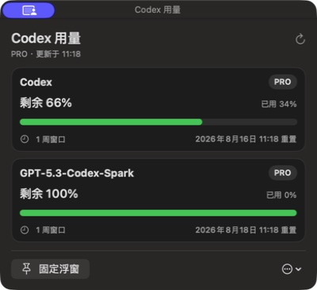

# Codex 用量监控（macOS）

[English](README.md) | [简体中文](README.zh-CN.md)

一个原生 macOS 菜单栏小工具，通过本机 Codex App Server 读取 Codex 剩余用量。



## 功能

- 菜单栏显示主限额剩余百分比。
- 在紧凑且无需滚动的面板中显示服务端返回的全部限额桶、窗口长度和重置时间。
- 每 60 秒自动刷新，也支持手动刷新。
- 启动时自动打开浮窗，并可保持窗口置顶。
- 优先跟随 Codex/ChatGPT 客户端语言，无法读取时回退到 macOS 首选语言。
- 支持简体中文和英文。
- 支持退出、应用内卸载和独立卸载脚本。
- 不读取或保存 ChatGPT Token，复用本机 Codex 登录状态。

## 系统要求

- macOS 13 或更高版本。
- 已安装并登录 ChatGPT 或 Codex 桌面客户端。
- 预编译版本面向 Apple Silicon；源码可为 Swift 支持的其他架构自行编译。

## 安装

从 [Releases](../../releases) 下载最新版 zip，解压后将应用拖入 `/Applications`。初始社区版本采用本地临时签名，尚未经过 Apple 公证；macOS 可能要求在“系统设置 > 隐私与安全性”中确认打开。

## 从源码构建

需要 Xcode Command Line Tools 和 Swift 6。

```sh
./scripts/build_app.sh
```

产物位于 `dist/Codex 用量监控.app`。

## 语言选择

应用启动时依次检查：

1. Codex/ChatGPT 的应用级语言偏好。
2. 已安装 Codex/ChatGPT 客户端的首选本地化语言。
3. macOS 首选语言。

中文语言变体显示简体中文，其他语言显示英文。维护者可通过 `--language=zh-Hans` 或 `--language=en` 测试两套界面。

## 卸载

从应用菜单选择“卸载应用…”，或运行：

```sh
./scripts/uninstall.sh "/Applications/Codex 用量监控.app"
```

卸载只删除应用及其偏好设置和缓存，不删除项目源码、Codex、Codex 登录信息或 Codex 历史。

## 用量计算

界面展示服务端返回的 `usedPercent`、`windowDurationMins` 和 `resetsAt`。剩余百分比按 `100 - usedPercent` 计算。不同计划或模型可能返回多个独立限额桶。

## 隐私与安全

- 数据仅通过本机 `codex app-server` 进程通信。
- 本应用不持久化凭据、Token 或用量历史。
- 应用内卸载前会校验精确 Bundle ID，避免误删其他内容。

## 参与贡献

欢迎提交 Issue 和 Pull Request。请阅读 [CONTRIBUTING.md](CONTRIBUTING.md) 和 [SECURITY.md](SECURITY.md)。

## 开源协议

[MIT](LICENSE)。本项目是独立社区项目，与 OpenAI 无隶属或背书关系。OpenAI、ChatGPT 和 Codex 商标归其权利人所有。
